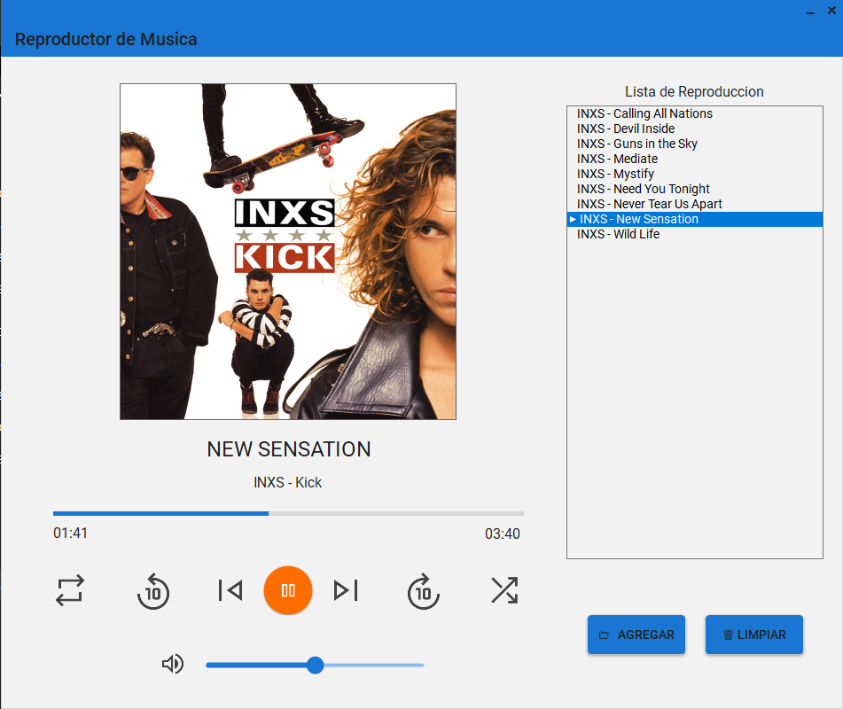

# Reproductor de Música

Un reproductor de música moderno y elegante desarrollado en C# con WinForms y MaterialSkin, diseñado específicamente para reproducir archivos FLAC con alta calidad de audio y soporte de otros formatos.

---

## Características

### Reproducción
- **Soporte FLAC**: Reproducción de alta calidad de archivos FLAC (16 Bits)
- **Lista de reproducción**: Agrega múltiples archivos y organízalos fácilmente
- **Control de reproducción**: Play, pause, siguiente, anterior
- **Avance/Retroceso**: Salta adelante o atrás 10 segundos instantáneamente
- **Repetición**: Activa el modo repeat para escuchar tu canción favorita en bucle
- **Shuffle**: Mezcla aleatoriamente la lista de reproducción con un solo clic

### Interfaz
- **Diseño Material UI**: Interfaz moderna con MaterialSkin
- **Portadas de álbum**: Extrae y muestra automáticamente las portadas de las canciones
- **Metadatos**: Muestra título, artista y álbum de cada canción
- **Barra de progreso**: Navega fácilmente a cualquier punto de la canción
- **Tooltips**: Información completa al pasar el mouse sobre textos largos

### Control de Volumen
- **Slider de volumen**: Control preciso del volumen
- **Botón de muteo**: Clic para mutear. Clic nuevamente para restaurar el volumen anterior.

### Gestión de Lista
- **Agregar archivos**: Selecciona múltiples archivos FLAC a la vez
- **Eliminar canciones**: Click derecho para eliminar canciones individuales
- **Limpiar lista**: Limpia toda la lista de reproducción con un botón

---

## Tecnologías Utilizadas

- **.NET 8+**: Framework de desarrollo principal
- **C#**: Lenguaje de programación
- **WinForms**: Framework de interfaz gráfica
- **MaterialSkin**: Biblioteca para diseño Material Design
- **NAudio**: Biblioteca para reproducción de audio
